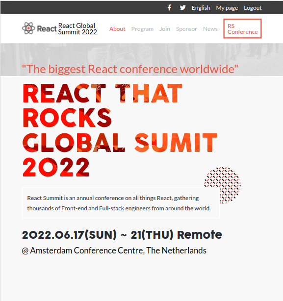

# Yuriy Chamkoriyski Capstoneproject 1 - React Summit

> First capstone project at Microverse.

## Description

The project you are going to build is based on an online website for a conference. We provide some design guidelines for you to create the website, but **you must personalize the content**, i.e., instead of a conference you can build a website for a concert or for a web development course. It's very important the you personalize your project so that you have something unique in your portfolio to share with potential employers during job searching.

### General requirements

- Make sure that there are no [linter errors](https://github.com/microverseinc/linters-config).
- Make sure that you used correct [GitHub flow](https://github.com/microverseinc/curriculum-transversal-skills/blob/main/git-github/articles/github_flow.md).
- Make sure that you documented your work [in a professional way](https://github.com/microverseinc/curriculum-transversal-skills/blob/main/documentation/articles/professional_repo_rules.md).

### HTML/CSS & JavaScript requirements

- Follow our list of [best practices for HTML & CSS](https://github.com/microverseinc/curriculum-html-css/blob/main/articles/html_css_best_practices.md).
- Follow our list of [best practices for JavaScript](https://github.com/microverseinc/curriculum-html-css/blob/main/articles/javascript_best_practices.md).

### Project requirements

- You should personalize the content of your page. Choose a topic that is different than the one in the original design.
- You should follow these [design guidelines](https://www.behance.net/gallery/29845175/CC-Global-Summit-2015), including:
  - Colors.
  - Typography: font face, size and weight.
  - Layout: composition and space between elements.
- The pages should look almost identical to the original design. Small adjustments like text or image changes are acceptable.
- You can use Bootstrap for styling, if you want to.
- You should build only these 2 pages:
  - The home page.
  - The about page.
- Each of these pages should have versions for 2 different screen sizes:
  - Mobile: up to 768px wide.
  - Desktop: 768px or wider.
- Interactions
  - Links
    - The home page should have a link in the menu to the about page.
    - The logo in the header links to the home page.
  - Mobile menu
    - When the user clicks (or taps) the hamburger button on the header, the mobile menu appears over the page.
    - There are no guidelines for the mobile menu in the docs, but you should implement it so it is consistent with the design (colors, typography, spacings, etc.).
    - The mobile menu should have a close (X) button that closes the menu.
- Dynamic page
  - The section "Featured speakers" should be created dynamically in JavaScript.
  - You should use a JavaScript variable with the data about the speakers and use it when the page loads to create the HTML for this section dynamically.

Original design idea by [Cindy Shin in Behance](https://www.behance.net/adagio07).
The [Creative Commons license of the design](https://creativecommons.org/licenses/by-nc/4.0/) requires that you give appropriate credit to the author. Therefore, you must do it in the README of your project.

### Project documentation

Once you have finished the development of the project, you should record a video presenting the features of the project you built. It is a video with a **maximum length of 5 minutes**. The content of the video should include:
  - A description of the project.
  - A demo of the project features (different pages and different screen sizes).
  - You should also highlight some interesting piece of code or something you built that you are very proud of.

For recording the video you can use tools like Loom that let you share a private link to the recording, and configure a shot that shows your computer screen and your face at the same time in a small picture.

**Add the video link to your pull request description.**

## Built With

- Major languages: HTMLC, CSS, JavaScript
- Frameworks: none
- Technologies used: GitHub, Lighthouse, Webhint, Stylelint, ESLint

## Live Demo

[Live Demo Link](https://hombre2014.github.io/Conference-page/)

## Getting Started

**Simply open the link above.**

To get a local copy up and running follow these simple example steps.

### Prerequisites

- Internet connection and a web browser

### Setup

- No setup required

### Install

- No installation required

### Usage

- Enter the URL address (https://hombre2014.github.io/Conference-page/) in your web browser

### Run tests

- Lighthouse, Webhint, Stylelint, ESLint

### Deployment

- Using GitHub Pages

## Author

👤 **Yuriy Chamkoriyski**

- GitHub: [@Hombre](https://github.com/Hombre)
- Twitter: [@Chamkoriyski](https://twitter.com/Chamkoriyski)
- LinkedIn: [axebit](https://linkedin.com/in/axebit)

## 🤝 Contributing

Contributions, issues, and feature requests are welcome!

Feel free to check the [issues page](https://github.com/Hombre/Conference-page/issues).

## Show your support

Give a ⭐️ if you like this project!

## Acknowledgments

Thanks [Cindy Shin in Behance](https://www.behance.net/adagio07) for original design.

## 📝 License

This project is [MIT](./MIT.md) licensed.
